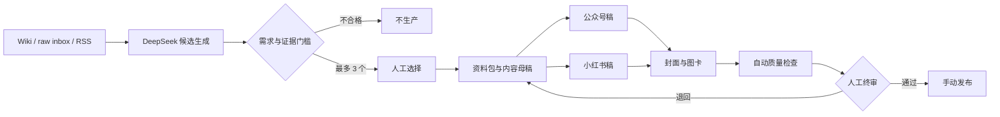

# Leo AI Content Ops CN

[](https://github.com/leo119110120-zhang/leo-ai-content-ops-cn/actions/workflows/tests.yml)
[](LICENSE)
[](https://www.python.org/)

一个本地优先、来源约束、人工终审的 AI 内容运营工作流，面向公众号与小红书。

> A local-first, source-constrained, human-in-the-loop AI content workflow for WeChat and Xiaohongshu.

它不是“自动洗稿机”，也不会替你登录或发布平台。系统负责从资料发现需求、筛选选题、生成双平台稿件、制作确定性图卡并完成质量检查；最终选择和发布权始终在人手里。

## 为什么做这个项目

很多 AI 内容工具只解决“生成文字”，但真正落地还缺少四层约束：

- **需求约束**：低分选题不会为了凑数量进入生产。
- **来源约束**：候选与事实声明必须引用实际输入来源。
- **平台适配**：公众号长文与小红书版本分别生成，不做机械复制。
- **人工终审**：本地页面完成选择、通过、退回或放弃，平台仍由本人手动发布。

## 工作流



## 已实现

- DeepSeek V4 Flash JSON 调用、用量记录与有限重试
- Wiki、只读 `raw/inbox`、选题池、RSS/Atom 来源采集
- 来源哈希缓存，避免重复消耗 token
- 选题六维评分与硬门槛：总分 ≥ 75，需求与当下性 ≥ 15
- 最多 3 个候选，不以低质量内容补位
- 公众号与小红书双平台稿件
- Pillow 生成确定性中文封面与图卡
- 来源、隐私、平台差异、图片尺寸等自动质量检查
- 本地候选选择页与终审页
- Windows 通知、断点恢复、幂等运行和工作日 10:30 计划任务脚本
- 67 项自动化测试和假模型端到端验证

## 快速开始（Windows）

```powershell
git clone https://github.com/leo119110120-zhang/leo-ai-content-ops-cn.git
cd leo-ai-content-ops-cn
python -m venv .venv
.\.venv\Scripts\Activate.ps1
python -m pip install -e ".[windows]"
```

安全设置 DeepSeek Key，不要把 Key 写入文件或发给他人：

```powershell
$key = Read-Host "DeepSeek API Key"
[Environment]::SetEnvironmentVariable("DEEPSEEK_API_KEY", $key, "User")
Remove-Variable key
```

重新打开 PowerShell，把资料放入 `wiki/` 或 `raw/inbox/`，然后手动试跑：

```powershell
leo-content-ops daily --root .
```

确认真实流程可用后，可安装工作日 10:30 计划任务：

```powershell
powershell -ExecutionPolicy Bypass -File scripts/install-content-ops-task.ps1
Get-ScheduledTask -TaskName LeoContentOpsDaily
```

卸载计划任务：

```powershell
powershell -ExecutionPolicy Bypass -File scripts/uninstall-content-ops-task.ps1
```

## 输入目录

```text
wiki/                         # Markdown 知识资料
raw/inbox/                    # 只读临时资料；程序绝不改写
content-ops/topics/           # 手工选题池
content-ops/config/sources.yaml # 允许扫描的公开 RSS/Atom
```

真实输入默认被 `.gitignore` 排除，避免误传公开仓库。

## 测试

```powershell
python -m unittest discover -s tests -v
python -m compileall -q content_ops tests
```

测试不需要真实 API Key，也不会产生模型费用。

## 项目边界

本项目：

- 不自动登录公众号或小红书
- 不保存 Cookie、OTP、密码或平台 Token
- 不自动发布内容
- 不承诺流量、爆款或收入
- 不把模型生成内容当作事实来源
- 不修改 `raw/` 中的原始资料

## 当前状态

`v0.1.0` 代码已完成本地测试和假模型端到端验证。真实 DeepSeek 付费请求、Windows 通知和计划任务需要使用者在自己的机器上完成首次验证。

## 路线图

- Codex 图片队列与失败兜底
- 发布后数据登记与周复盘
- 可插拔模型供应商
- 更多中文内容平台模板
- 更完整的跨平台安装器

## 参与贡献

欢迎提交 Issue 和 Pull Request。开发说明见 [CONTRIBUTING.md](CONTRIBUTING.md)，安全问题见 [SECURITY.md](SECURITY.md)。

## License

[MIT](LICENSE)
